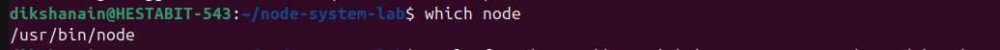
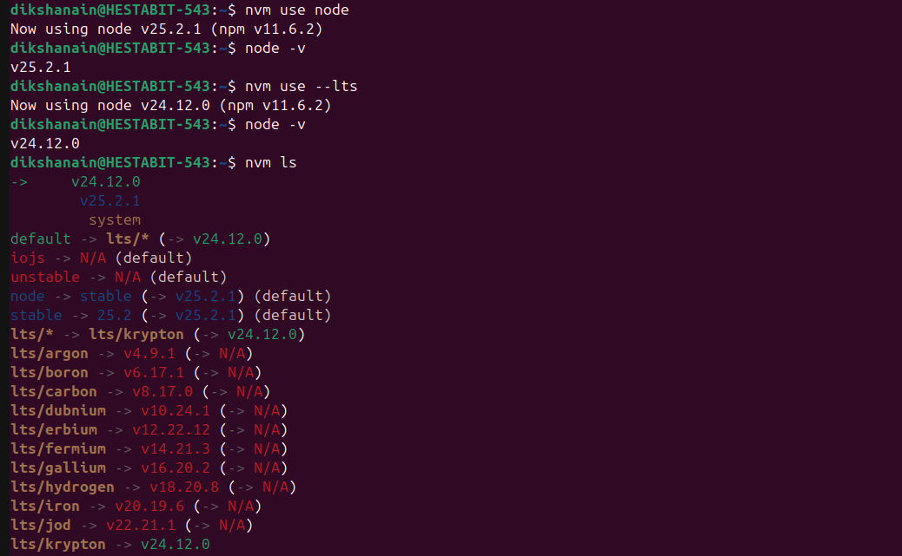

## Task 1: System Identification

### 1. OS Version

**Command used:**

---
### 2. Current shell

**Command used:**

### 3. Node Binary Path

**Command used:**

---

### 4. NPM Global Installation Path

**Command used:**

---

### 5. PATH Entries that include `node` or `npm`

**Command used:**

---

## Task 2: Install & Use NVM (Node Version Manager)

### 1. Install NVM

**Command used:**

---

### 2. Switch Node from LTS → Latest and back

**Command used:**

---

## Summary

