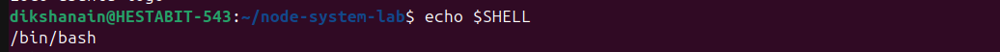
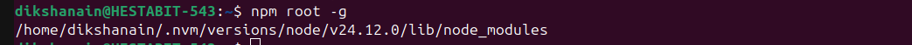
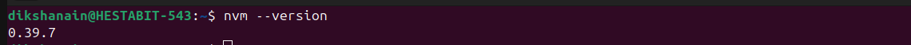

## Task 1: System Identification

### 1. OS Version

The following command was used to identify the operating system and version running on the machine.

**Screenshot:**

---
### 2. Current shell

This command was used to determine the currently active shell environment.

**Screenshot:**

---

### 3. Node Binary Path

This command was used to locate the path of the Node.js binary being used by the system.

**Screenshot:**

---

### 4. NPM Global Installation Path

This command was used to identify the global installation directory for npm packages.

**Screenshot:**

---

### 5. PATH Entries that include `node` or `npm`

This command was used to list all PATH environment entries containing references to `node` or `npm`.

**Screenshot:**

---

## Task 2: Install & Use NVM (Node Version Manager)

### 1. Install NVM

NVM (Node Version Manager) was installed to manage multiple Node.js versions efficiently.

**Screenshot:**

---

### 2. Switch Node from LTS → Latest and back

Using NVM, the Node.js version was switched from the LTS version to the latest available version and then reverted back to LTS.

**Screenshot:**

---

## Summary

In these tasks, the system environment was identified, Node.js and npm paths were verified, and NVM was used to manage and switch between different Node.js versions successfully.
