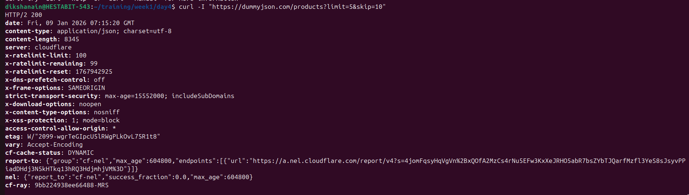
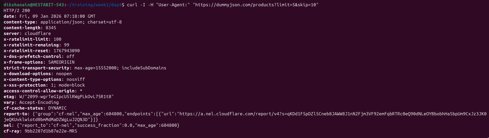
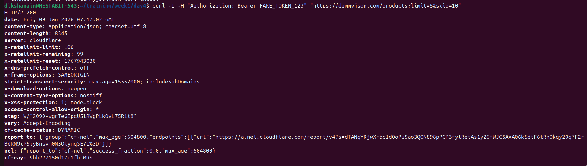
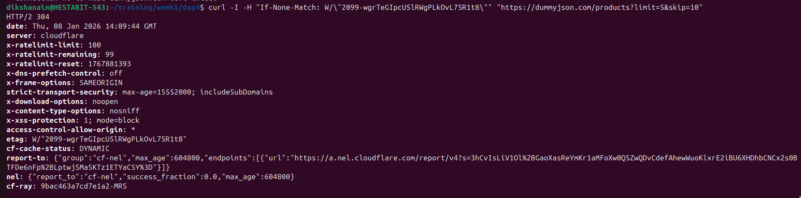
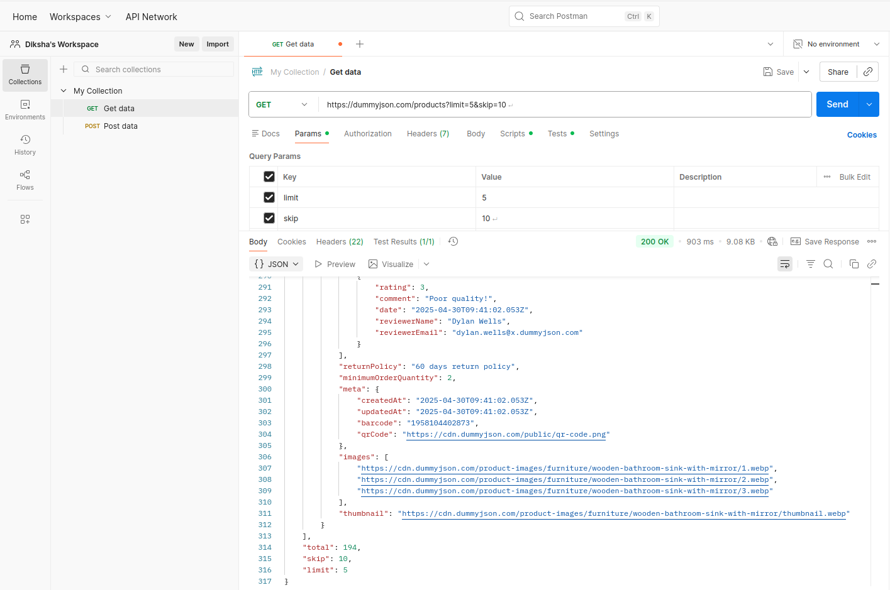
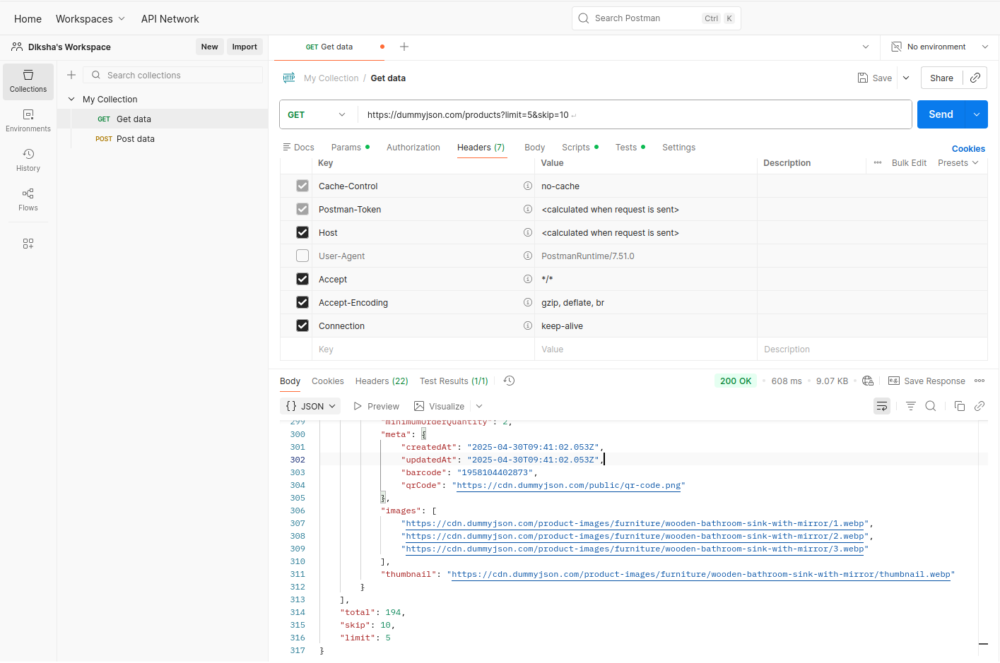
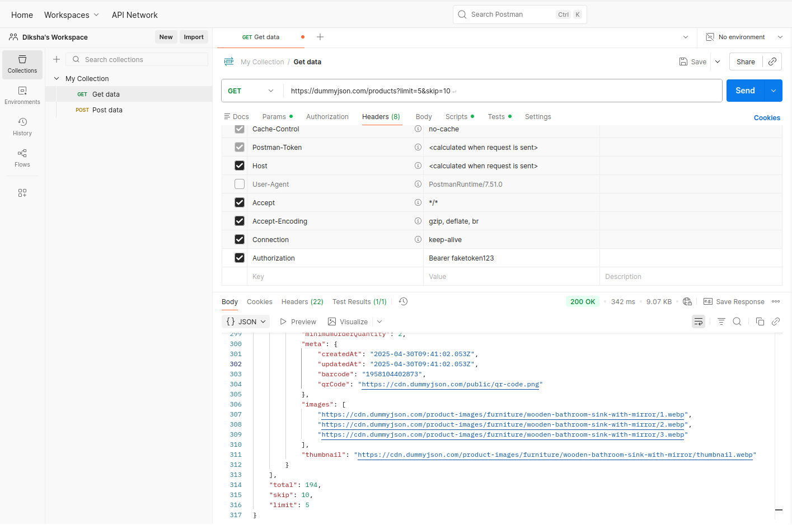
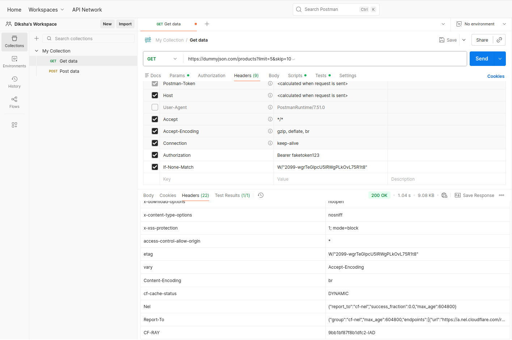

# API Investigation Report  

## Objective
This document analyzes HTTP request–response behavior using the DummyJSON API, focusing on:
- Pagination
- HTTP Headers
- Caching using ETag  
The investigation was performed using **CURL** and **Postman**.


## 1. Pagination Analysis

#### Endpoint Used

GET https://dummyjson.com/products?limit=5&skip=10


#### Observations
- `limit=5` restricts the response to **5 products**
- `skip=10` skips the first **10 records**
- The response confirms pagination metadata:
  ```json
  {
    "total": 194,
    "skip": 10,
    "limit": 5
  }
- This proves the API supports offset-based pagination
- Pagination is handled entirely via query parameters

  Screenshot: Pagination request & response



## 2. Header Analysis
Default Request (cURL)

curl -v https://dummyjson.com/products?limit=5&skip=10

Key Request Headers Observed-
`User-Agent`
`Accept`
`Host`

Key Response Headers Observed

`ETag`
`Cache-Control`
`CF-Cache-Status`
`X-RateLimit-*`
`Security headers (X-Frame-Options, X-Content-Type-Options)`

### 2.1 Removing User-Agent Header

curl -v -H "User-Agent:" https://dummyjson.com/products?limit=5&skip=10

#### Observation

- Response body remained unchanged
- Status code remained 200 OK
- Server does not enforce User-Agent validation


Screenshot: Request without User-Agent


## 2.2 Fake Authorization Header

curl -v -H "Authorization: Bearer fake_token_123" https://dummyjson.com/products?limit=5&skip=10

#### Observation

- Response returned 200 OK
- No authentication error occurred
- API ignored invalid Authorization header

Screenshot: Fake Authorization Header


## 3. Caching & ETag Analysis

Step 1: Fetch ETag

curl -I https://dummyjson.com/products?limit=5&skip=10


Response included:

ETag: W/"2099-wgrTeGIpcU5lRWgPLkOvL75R1t8"

Step 2: Conditional Request using If-None-Match

curl -v -H "If-None-Match: W/\"2099-wgrTeGIpcU5lRWgPLkOvL75R1t8\"" \
https://dummyjson.com/products?limit=5&skip=10

#### Observation

- Server returned HTTP 304 Not Modified
- No response body was sent
- Same ETag value returned in headers


Screenshot: 304 Not Modified Response


## 4. Postman Validation

The same requests were reproduced using Postman Desktop Agent:

- Pagination parameters
- Header modification (User-Agent & Authorization)
- Conditional request using If-None-Match

Results matched cURL behavior, confirming consistency across tools.

Screenshots:








