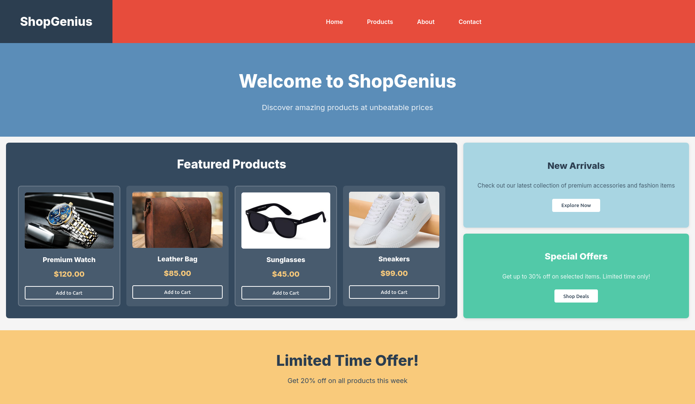

# Day 2: CSS Layout Mastery - ShopGenius

## Overview
A responsive e-commerce layout built using **Flexbox** and **CSS Grid**, following a mobile-first approach.

---

## Reference vs Implementation

### Reference Layout


### My Implementation


---

## Technical Implementation

### 1. Flexbox Usage

| Component | Purpose | Code |
|:---|:---|:---|
| **Navbar** | Switch layout mobile→desktop | `flex-direction: column` → `row` |
| **Menu** | Align nav links horizontally | `display: flex; justify-content: center` |
| **Hero** | Center content | `display: flex; align-items: center` |
| **Sidebar** | Stack boxes vertically | `flex-direction: column` |


---

### 2. CSS Grid Usage

| Component | Purpose | Code |
|:---|:---|:---|
| **Main + Sidebar** | 2-column layout | `grid-template-columns: 2fr 1fr` |
| **Product Grid** | Responsive columns | `repeat(2, 1fr)` → `repeat(3, 1fr)` |

---

### 3. Responsive Breakpoints

```css
/* Mobile (Default) */
.navbar { flex-direction: column; }
.product-grid { grid-template-columns: 1fr; }

/* Tablet (640px+) */
@media (min-width: 640px) {
    .product-grid { grid-template-columns: repeat(2, 1fr); }
}

/* Desktop (768px+) */
@media (min-width: 768px) {
    .navbar { flex-direction: row; }
    .content-wrapper { grid-template-columns: 2fr 1fr; }
}
```

---

### 4. CSS Specificity Demonstrations

```css
/* Pseudo-class (11 points) */
.product-card:nth-child(odd) { border: 2px solid rgba(255,255,255,0.2); }

/* Attribute selector (11 points) */
button[type="button"]:hover { box-shadow: 0 4px 12px rgba(0,0,0,0.3); }

/* Direct child combinator */
.sidebar > div { box-shadow: 0 2px 8px rgba(0,0,0,0.1); }
```

---

## Responsive Behavior

| Viewport | Navbar | Product Grid | Main+Sidebar |
|:---|:---|:---|:---|
| **Mobile** (375px) | Stacked | 1 column | Stacked |
| **Tablet** (768px) | Side-by-side | 2 columns | Side-by-side |
| **Desktop** (1200px) | Side-by-side | 2-3 columns | 66% + 33% |

---


