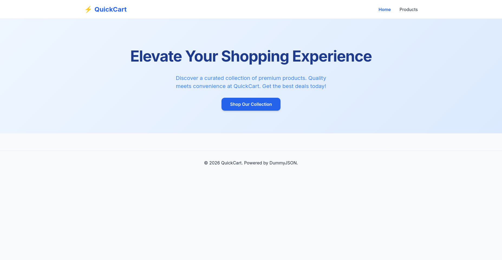
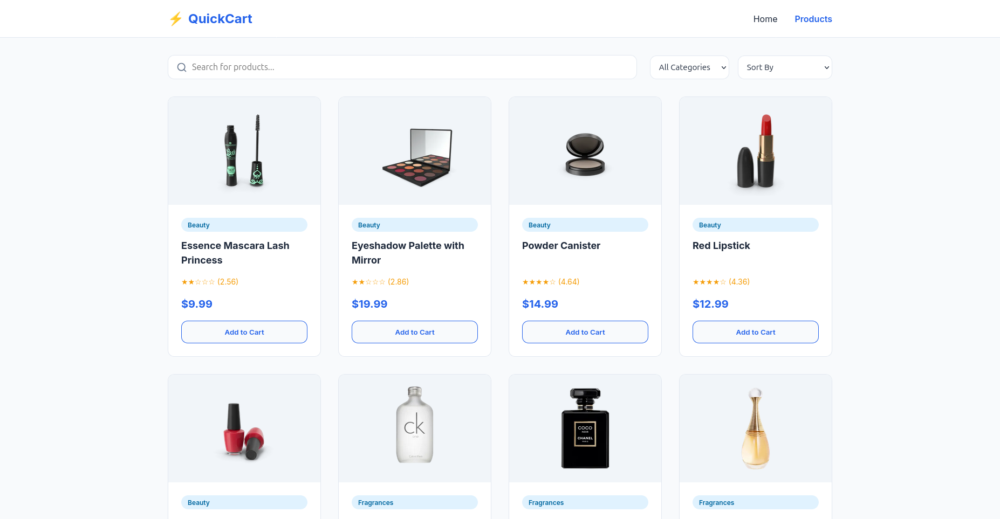
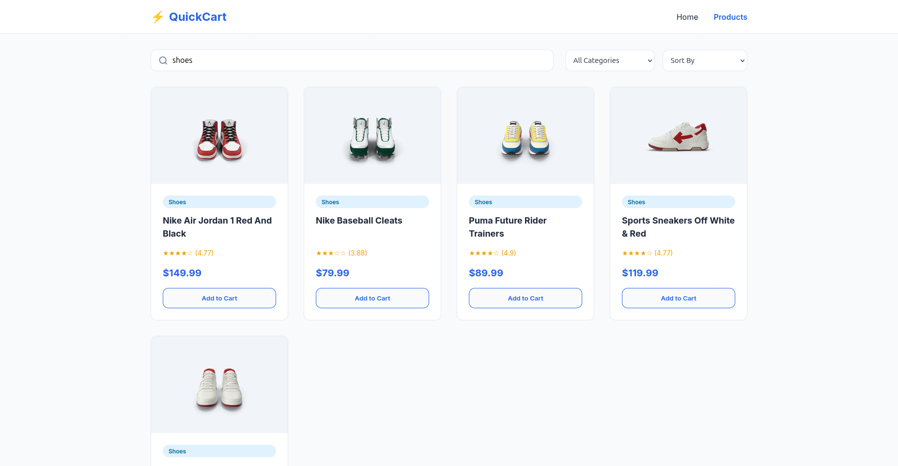
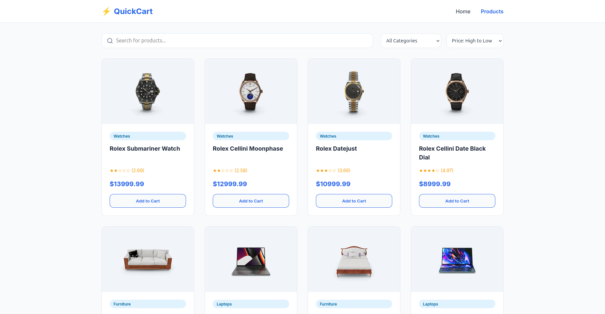
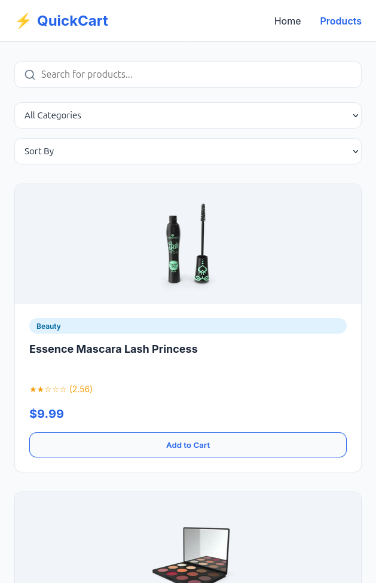

# DAY 5 – Capstone UI + JS Project

A modern, responsive e-commerce product listing page built with Vanilla JS, HTML, and CSS.

## Features
- **Fetch API**: Uses `https://dummyjson.com/products`.
- **Search**: Interactive search bar.
- **Filter**: Category-based filtering.
- **Sort**: Price-based sorting (High to Low / Low to High).
- **Responsive**: Works on Mobile, Tablet, and Desktop.

## Project Highlights

### 1. Landing Page

Designed a clean and modern landing page with a clear "Shop Now" button to guide users effectively to the main product catalog.

### 2. Product Catalog

Fetched data from the DummyJSON API and displayed it in a responsive grid layout. The interface is designed to present product information clearly.

### 3. Search Functionality

Implemented real-time search that works across product titles and categories. The logic ensures that the category filter automatically resets when searching, preventing any confusion with hidden results.

### 4. Sorting Feature

Added functionality to sort products by price (High to Low and Low to High). This required manipulating the product array using JavaScript to dynamically reorder items in the UI.

### 5. Mobile Responsiveness

Ensured the application is fully responsive. On mobile devices, the product grid automatically adapts to a single-column layout for optimal readability and usability.

## Key Learnings

This project helped me understand how to build a complete web application using only core web technologies.

*   **Fetch API**: Learned how to retrieve data asynchronously using `async/await` and handle responses to populate the page with dynamic content.
*   **CSS Grid & Variables**: Practiced using modern CSS features like Grid for flexible layouts and CSS Variables to keep the design consistent and easy to maintain.
*   **State Management**: Understood the importance of managing application state—keeping the original list of products separate from the filtered list to allow for seamless search and sort operations.
*   **Data Handling**: Gained experience in cleaning up API data before displaying it, such as removing unnecessary prefixes from category names to improve the user interface.
