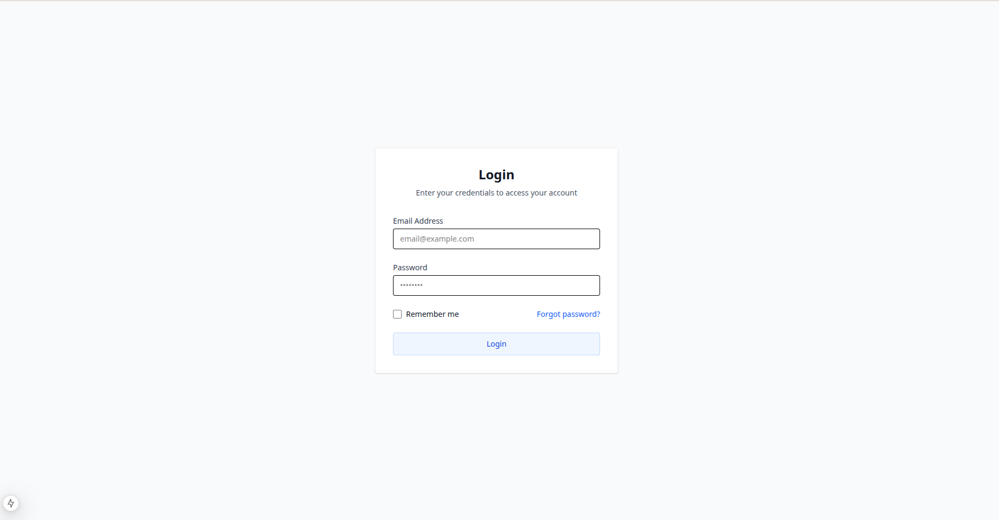
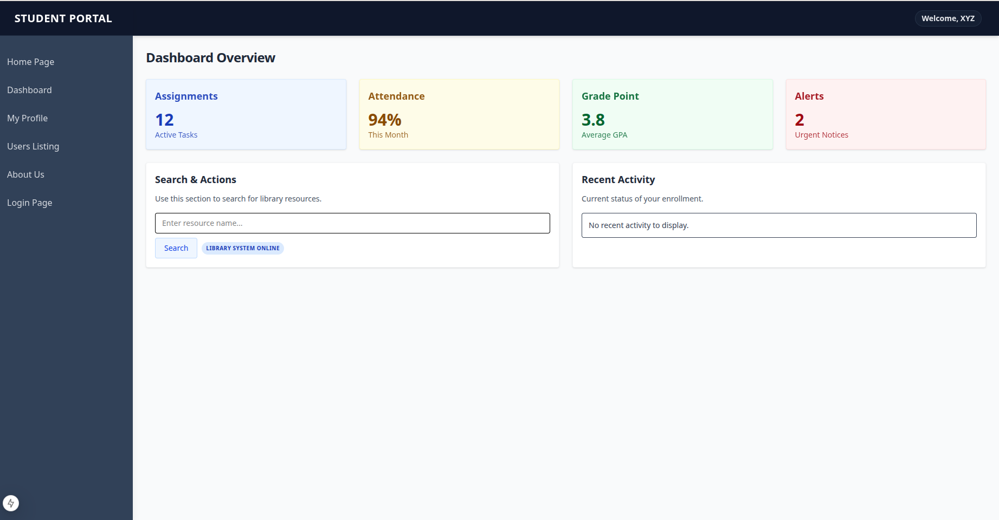
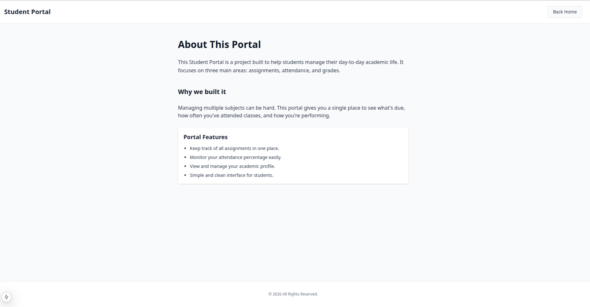
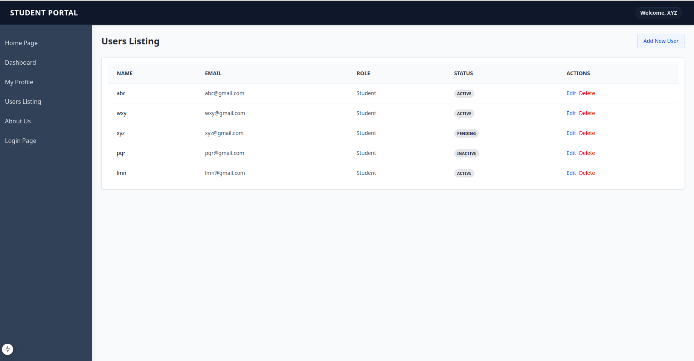
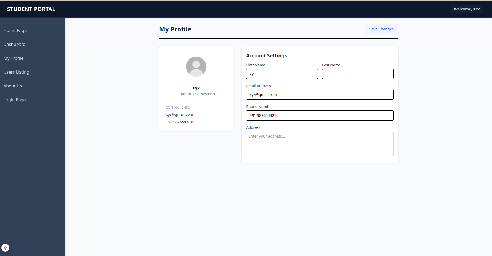

# Week 3 - Capstone Mini Project 

This project is a multi-page dashboard application built with Next.js and Tailwind CSS. It focuses on clean UI, component reuse, and mobile responsiveness.

## Project Structure
```text
/app
  ├── layout.jsx         - Root layout
  ├── page.jsx           - Landing page
  ├── about/             - About Us page
  ├── login/             - Login page
  └── dashboard/         - Dashboard group
      ├── layout.jsx     - Dashboard layout (Sidebar + Navbar)
      ├── page.jsx       - Dashboard overview
      ├── profile/       - Profile page
      └── users/         - Users listing table
/components/ui
  ├── Badge.jsx
  ├── Button.jsx
  ├── Card.jsx
  ├── Input.jsx
  ├── Modal.jsx
  ├── Navbar.jsx
  ├── Sidebar.jsx
  └── index.js
```


## Components List
Found in `/components/ui`:
- `Badge`: Status and role indicator
- `Button`: Primary/Secondary action buttons
- `Card`: Container for widgets and forms
- `Input`: Standardized text fields
- `Modal`: Overlay for critical actions (optional)
- `Navbar`: Top navigation bar
- `Sidebar`: Collapsible/Fixed side navigation with dynamic links

### Landing_Page


### Login Page


### Dashboard


### About Us


### Users Listing


### Profile Page


## Lessons Learned
- **Layout Mastery**: Utilized `layout.jsx` to maintain persistent navigation (Sidebar/Navbar) while refreshing only page content.
- **Component Reusability**: Built a custom UI library in `/components/ui` to ensure design consistency and speed up page creation.
- **Tailwind Efficiency**: Leveraged responsive utility classes directly in JSX for rapid mobile-first prototyping without external CSS.
- **Prop Logic**: Learned to destructure custom React props (like `fullWidth`) to prevent them from reaching and erroring standard DOM elements.
- **Mock Data Handling**: Used JavaScript array methods like `.map()` to render professional-looking tables and lists from static arrays before a backend is ready.
