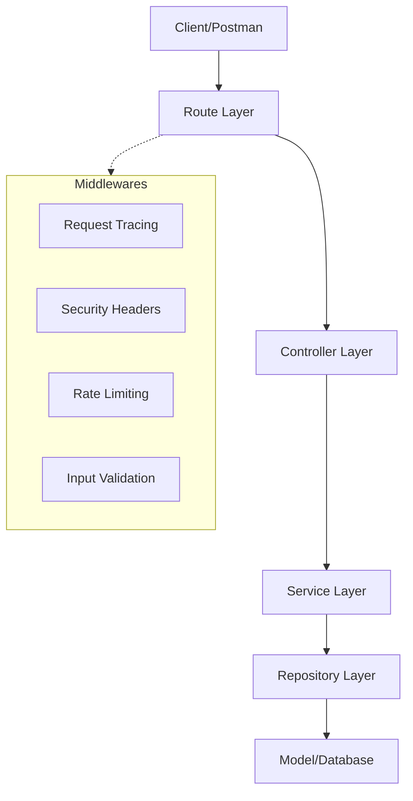
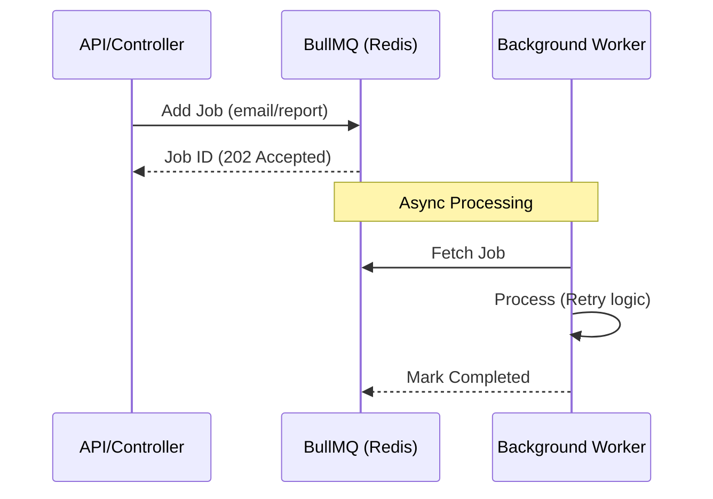
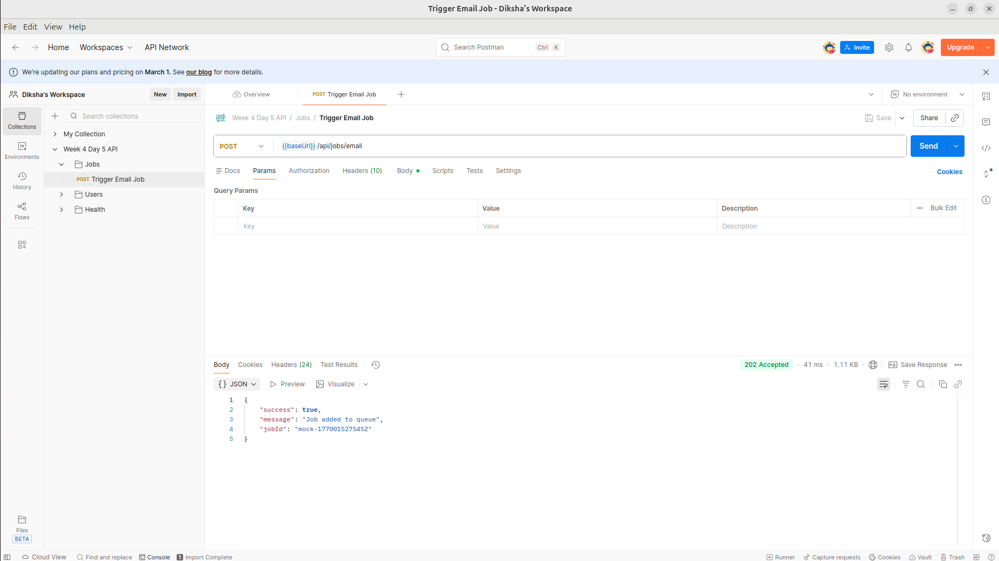

# NODE + PROJECT ARCHITECTURE

This project follows a clean, layered architecture to ensure scalability, maintainability, and separation of concerns.

## Directory Structure

- `src/config/`: Configuration management (env variables, constants).
  - `index.js`: Environment-based config loader with fallback support
- `src/loaders/`: Bootstrapping logic (Express, MongoDB, Routes, etc.).
  - `app.js`: Express application setup and middleware configuration
  - `db.js`: Database connection initialization
  - `redis.js`: Redis/ioredis-mock connection loader
  - `routes.js`: Route mounting and dynamic endpoint counting
- `src/models/`: Database schemas and models (Mongoose).
  - `User.js`: User schema with pre-save hooks and indexes
  - `Product.js`: Product schema with soft delete and creator relation
- `src/routes/`: API route definitions.
- `src/controllers/`: Request handling and response formatting.
  - `product.controller.js`: Orchestrates product-related requests
- `src/services/`: Business logic layer.
  - `product.service.js`: Handles core business rules (filtering, sorting)
- `src/repositories/`: Data access layer (abstraction over DB).
  - `user.repository.js`: CRUD operations for Users
  - `product.repository.js`: CRUD operations for Products with advanced filtering
- `src/middlewares/`: Express custom middlewares (auth, validation, error).
  - `error.middleware.js`: Centralized global error handling
  - `validate.js`: Joi-based input validation
  - `security.js`: Multi-layered security (Helmet, rate limiting, etc.)
- `src/utils/`: Shared utility functions and helpers.
  - `logger.js`: Winston-based centralized logging
  - `tracing.js`: AsyncLocalStorage-based request tracing (correlation IDs)
- `src/jobs/`: Background tasks and async queues.
  - `email.job.js`: BullMQ-based email notification system
- `src/logs/`: Application log files (error.log, combined.log).

## Application Startup Flow

The application starts in the following order:

1. Environment configuration is loaded.
2. Logger is initialized.
3. Database connection is established.
4. Express application is initialized.
5. Global middlewares are applied.
6. API routes are mounted and total endpoint count is logged.
7. Global error handlers are registered.
8. Server starts listening on the configured port.

Startup orchestration is handled from `src/index.js` using loaders.

## Architectural Diagrams

### Layered Architecture

### Async Job Workflow

## API Verification

### Postman Test Suite
Visual proof of the Job Queue and Tracer system working together as seen in Postman:

