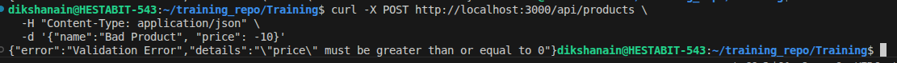
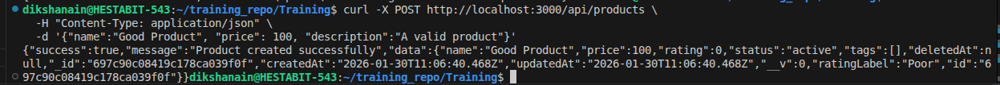
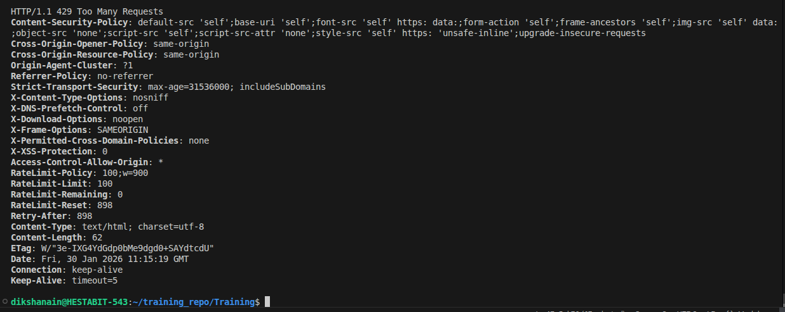
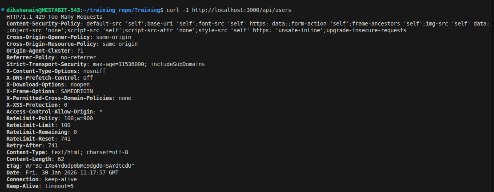
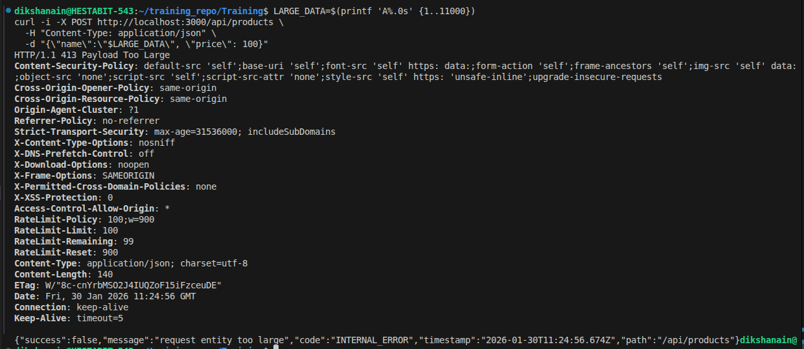
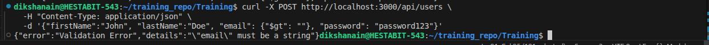
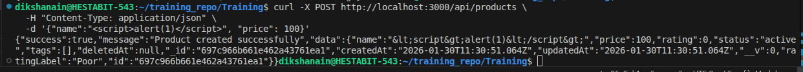

# Security Test Report

## 1. Input Validation Tests (Joi)

### Case 1.1: Create User with Invalid Email
- **Command:**
  ```bash
  curl -X POST http://localhost:3000/api/users \
  -H "Content-Type: application/json" \
  -d '{"firstName":"John", "lastName":"Doe", "email":"invalid-email", "password":"password123"}'
  ```
- **Expected Result:** `400 Bad Request` with validation error details.
- **Actual Result:** 


### Case 1.2: Create Product with Negative Price
- **Command:**
  ```bash
  curl -X POST http://localhost:3000/api/products \
  -H "Content-Type: application/json" \
  -d '{"name":"Bad Product", "price": -10}'
  ```
- **Expected Result:** `400 Bad Request` regarding price being negative.
- **Actual Result:** 


### Case 1.3: Valid Product Creation
- **Command:**
  ```bash
  curl -X POST http://localhost:3000/api/products \
  -H "Content-Type: application/json" \
  -d '{"name":"Good Product", "price": 100, "description":"A valid product"}'
  ```
- **Expected Result:** `200 OK` (or `201 Created` depending on controller).
- **Actual Result:** 



## 2. Rate Limiting Tests

### Case 2.1: Rate Limit Check
- **Action:** Send > 100 requests within 15 minutes from the same IP.
- **Command (Simulate loop):**
  ```bash
  for i in {1..105}; do curl -I http://localhost:3000/api/users; done
  ```
- **Expected Result:** Requests after the 100th should receive `429 Too Many Requests`.
- **Actual Result:** 


## 3. Security Headers (Helmet)

### Case 3.1: Check Headers
- **Command:**
  ```bash
  curl -I http://localhost:3000/api/users
  ```
- **Expected Result:** Response headers should include:
  - `X-DNS-Prefetch-Control: off`
  - `X-Frame-Options: SAMEORIGIN`
  - `Strict-Transport-Security` (if HTTPS)
  - `X-Content-Type-Options: nosniff`
- **Actual Result:** 



## 4. Payload Size Limit

### Case 4.1: Oversized Payload
- **Action:** Send a JSON body larger than 10kb.
- **Expected Result:** `413 Payload Too Large`.
- **Actual Result:** 



## 5. NoSQL Injection & Sanitization

### Case 5.1: NoSQL Injection Attempt
- **Command:**
  ```bash
  curl -X POST http://localhost:3000/api/users \
  -H "Content-Type: application/json" \
  -d '{"firstName":"John", "lastName":"Doe", "email": {"$gt": ""}, "password": "password123"}'
  ```
- **Expected Result:** Should be sanitized or fail validation (email must be string). Middleware `express-mongo-sanitize` should strip the `$`.
- **Actual Result:** 


### Case 5.2: XSS Attempt
- **Command:**
  ```bash
  curl -X POST http://localhost:3000/api/products \
  -H "Content-Type: application/json" \
  -d '{"name":"<script>alert(1)</script>", "price": 100}'
  ```
- **Expected Result:** Name should be sanitized to `&lt;script&gt;alert(1)&lt;/script&gt;` or validation error if special chars blocked.
- **Actual Result:** 

