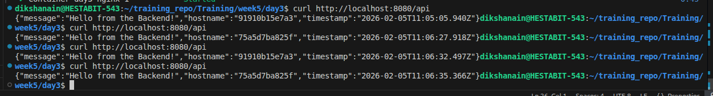

# Day 3: NGINX Reverse Proxy and Load Balancing

This project demonstrates how to use NGINX as a reverse proxy and load balancer within a Docker environment.

## Architecture

- **NGINX**: Acts as the entry point (Port 80). It routes traffic to the backend services.
- **Backend Service**: A Node.js application running 2 replicas.
- **Load Balancing**: NGINX uses the Round-Robin algorithm (by default) to distribute traffic between the two backend instances.

## How to Run

1.  **Build and Start**:
    ```bash
    docker compose up -d --build
    ```

2.  **Verify Load Balancing**:
    Run the following command multiple times:
    ```bash
    curl http://localhost:8080/api
    ```
    We will notice the `hostname` field in the JSON response alternating between two different container IDs.

### Verification Screenshot


3.  **Check Logs**:
    ```bash
    docker compose logs -f
    ```

## Files Description

- `nginx.conf`: Contains the NGINX configuration for the `upstream` group and `proxy_pass`.
- `docker-compose.yml`: Defines the services, replicas, and networking.
- `backend/`: Contains the Node.js application code and Dockerfile.
