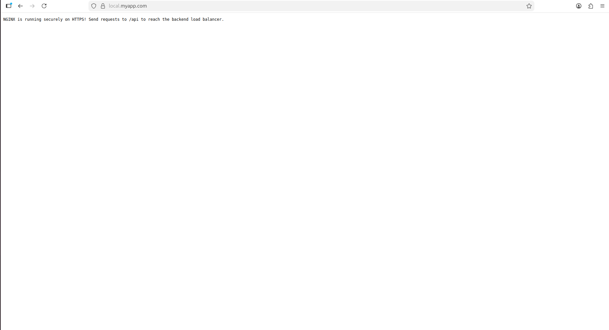
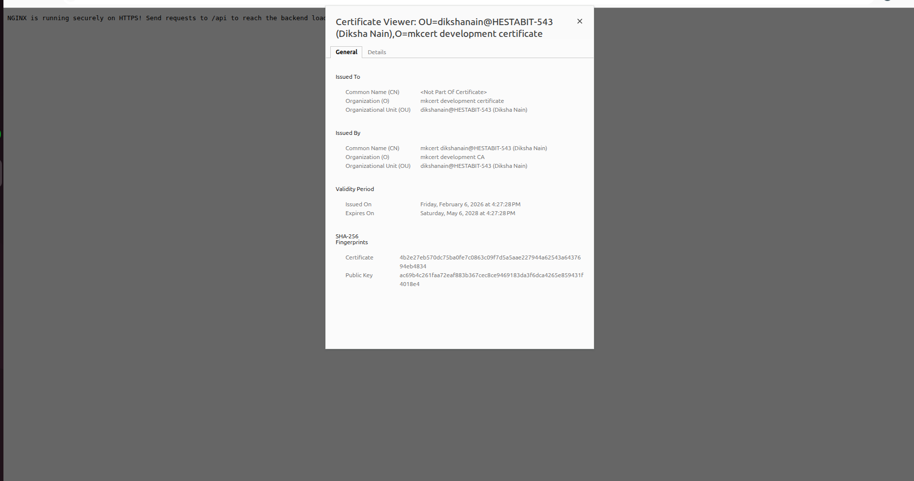
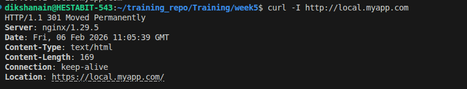

# SSL Setup Guide (Step-by-Step)

This guide shows exactly how I secured the project with HTTPS.

## 1. Install Security Tools
First, we need `mkcert` (to create certificates) and its helper tool.

```bash
# Update package list
sudo apt update

# Install mkcert and browser support tools
sudo apt install -y mkcert libnss3-tools
```

## 2. Initialize local CA
This makes computer trust the certificates we are about to create.

```bash
mkcert -install
```

## 3. Generate the Certificates
We create the identity card for our local domain.

```bash
mkdir -p nginx/certs

# Create the cert and key files
mkcert -cert-file nginx/certs/local.myapp.com.crt \
       -key-file nginx/certs/local.myapp.com.key \
       local.myapp.com localhost 127.0.0.1 ::1
```

## 4. Setup Local Domain
Tell computer that `local.myapp.com` lives on your machine.

```bash
echo "127.0.0.1 local.myapp.com" | sudo tee -a /etc/hosts
```

## 5. Start the Project
```bash
docker compose up -d --build
```

## 6. Screenshots

1. **`https-screenshot.png`**: (Showing the address bar with the lock icon)


2. **`cert-details.png`**: (Showing the valid certificate popup)


## 7. Verification Steps

### 7.1 Redirect Test (HTTP → HTTPS)
Run this command to check if the redirect works:
```bash
curl -I http://local.myapp.com
```

**Result:**
```text
HTTP/1.1 301 Moved Permanently
Location: https://local.myapp.com/
```



### 7.2 Browser Test
1. Open browser and go to `http://local.myapp.com`.
2. It should automatically take you to `https://local.myapp.com`.
3. Check for the lock icon.
