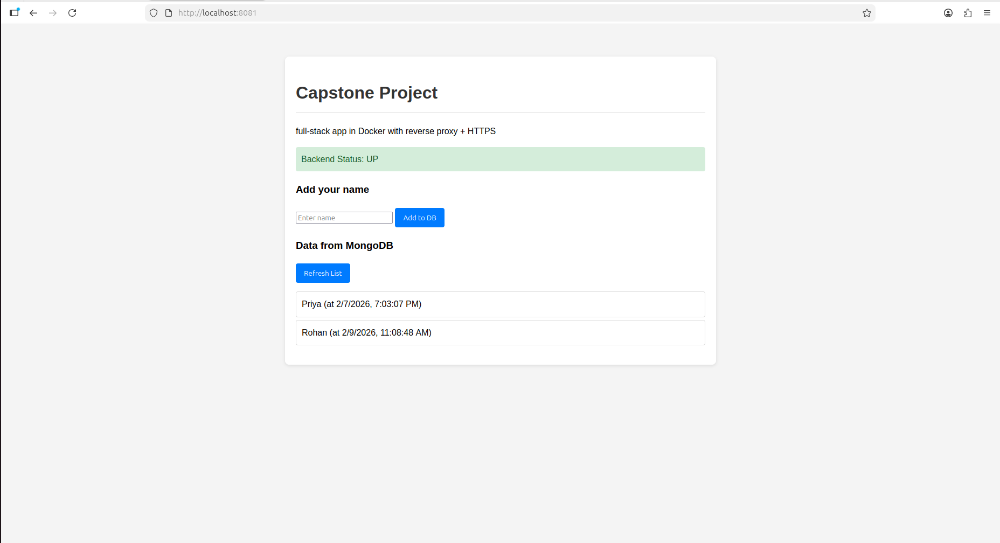
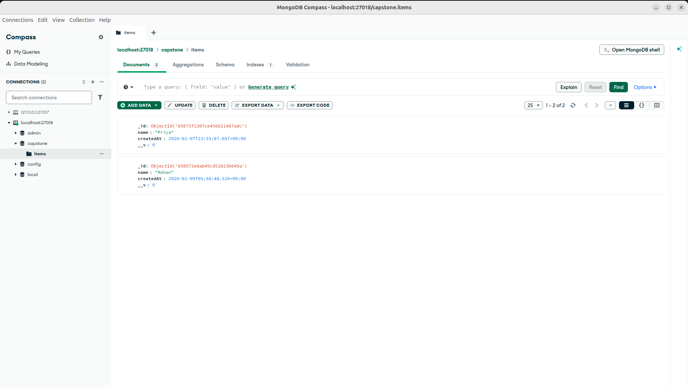

# Production Deployment Guide (Day 5 Capstone)

This guide explains how to deploy and manage our simple full-stack application using Docker.

## 1. Setup Environment
Copy the example environment file and update secrets:
```bash
cp .env.example .env
```

## 2. Deployment
A simple bash script to automate the deployment process:
```bash
chmod +x deploy.sh
./deploy.sh
```

## 3. Production Features

### Health Checks
Docker monitors the status of our services. We can check the health status with:
```bash
docker compose -f docker-compose.prod.yml ps
```

### Log Rotation
To prevent logs from consuming all disk space, we've configured log rotation in `docker-compose.prod.yml`:
- Max segment size: 10MB
- Max files kept: 3

### Data Persistence
MongoDB data is stored in a Docker volume called `mongodb_data`. This ensures data is safe even if the container is restarted or deleted.

### Reverse Proxy (Nginx)
Nginx acts as the entry point. It listens on port 80 (internal) which I have mapped to **port 8081** on your computer. It routes traffic as follows:
- `/api/*` -> Backend Server (Express)
- Everything else -> Frontend (Static HTML)

## 4. Manual Testing
1. Visit `http://localhost:8081` in browser.
2. Verify "Backend Status: UP" is displayed.
3. Add an item and refresh the list to verify database connectivity.
4. Try stopping a container: `docker stop capstone-api`.
5. Observe the UI health status change to "DOWN".
6. Restart it: `docker compose -f docker-compose.prod.yml up -d`.
7. Verify functionality returns.

## 5. Visual Verification
- **Website Interface**:


- **MongoDB Compass**:

