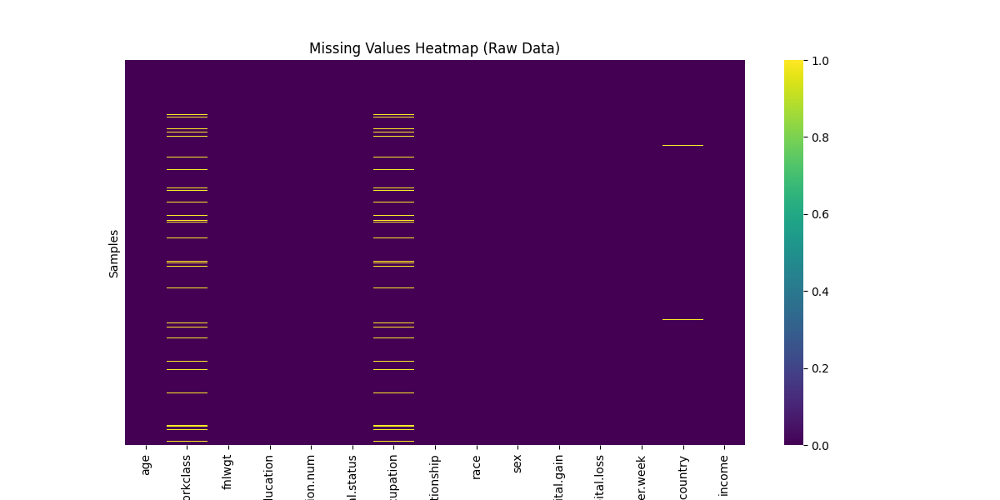
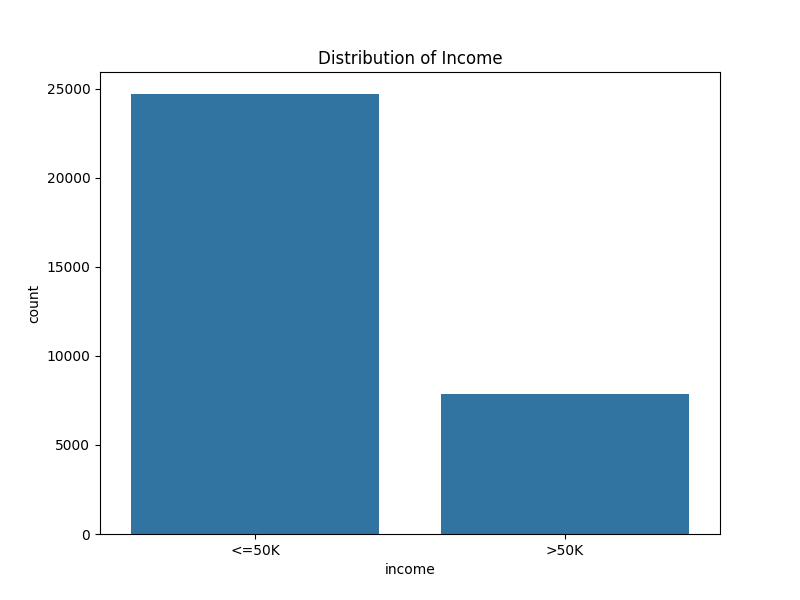
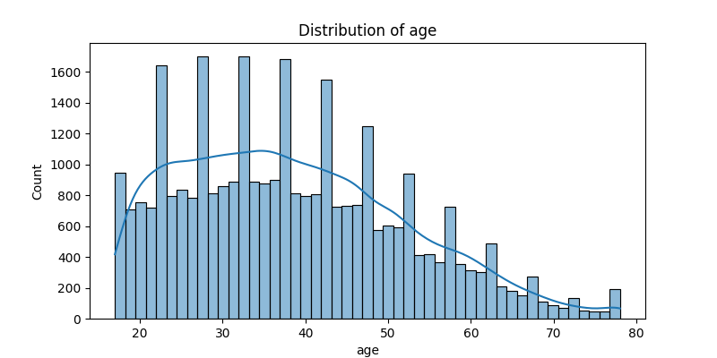
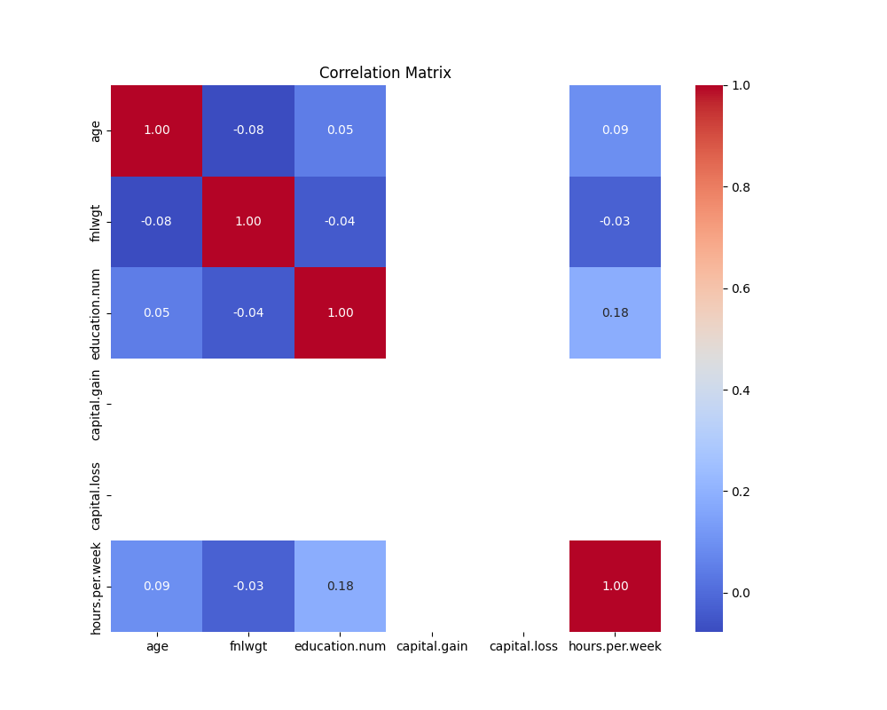

# Data Report

## 1. Dataset Overview
- **Source**: `data/raw/adult.csv` (Adult Census Income : Kaggle)
- **Processed**: `data/processed/final.csv`
- **Total Samples**: 32,537 (after cleaning)
- **Features**: 15 (Age, Workclass, Education, Marital Status, Occupation, Relationship, Race, Sex, Capital Gain/Loss, Hours per week, Native Country, Income)

## 2. Data Cleaning Summary
- **Missing Values**:
  - Imputed categorical columns (e.g., `workclass`, `occupation`) with **Mode**.
  - Imputed numerical columns (e.g., `age`) with **Median**.
- **Duplicates**: Removed **24** duplicate rows.
- **Outliers**:
  - Handled using **IQR Method** (Capped at 1.5 * IQR).
  - Impacted columns: `age`, `fnlwgt`, `education-num`, `capital-gain`, `hours-per-week`.

## 3. Exploratory Data Analysis (EDA)

### Missing Values Heatmap
Visualization of missing data patterns in the raw dataset before cleaning.

### Target Distribution
The dataset shows a class imbalance between `<=50K` and `>50K`.

### Numerical Feature Distributions
- **Age**: Right-skewed distribution, capped at upper bound.

### Correlation Analysis
- High correlation observed between `education-num` and `income` (requires encoding to visualize fully).
- `capital-gain` is a strong indicator for `>50K` income.

## 4. Key Findings
1.  **Imbalance**: The majority of the dataset earns `<=50K`.
2.  **Missing Data**: Significant missing values in `occupation` and `workclass` were handled, preserving data integrity.
3.  **Outliers**: `capital-gain` and `capital-loss` have extreme values; capping was applied to prevent model skew.
