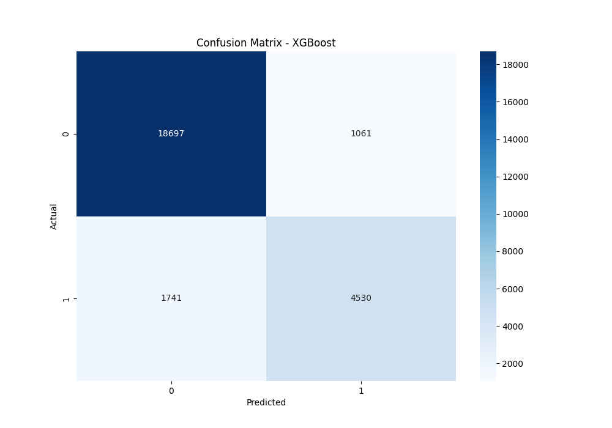

# Model Comparison Report

## Summary Table

|                     |   Accuracy |   Precision |   Recall |   F1 Score |   ROC-AUC |
|:--------------------|-----------:|------------:|---------:|-----------:|----------:|
| Logistic Regression |   0.835299 |    0.702879 | 0.548239 |   0.615933 |  0.888005 |
| Random Forest       |   0.826732 |    0.664335 | 0.567852 |   0.612265 |  0.874726 |
| XGBoost             |   0.830766 |    0.669517 | 0.587946 |   0.626001 |  0.883769 |
| Neural Network      |   0.820816 |    0.639997 | 0.592888 |   0.614201 |  0.867848 |

## Best Model Selection
The best model selected is **XGBoost** based on the highest F1 Score.

## Discussion
- **Logistic Regression**: Serves as a strong baseline with L2 regularization.
- **Random Forest**: Provides high accuracy and robustness through ensemble learning.
- **XGBoost**: Highly optimized gradient boosting, often the best performer for structured data.
- **Neural Network**: Multi-layer Perceptron capturing non-linear relationships.

All models were evaluated using 5-fold cross-validation to ensure generalization and control for overfitting.

## Confusion Matrix (Best Model)

