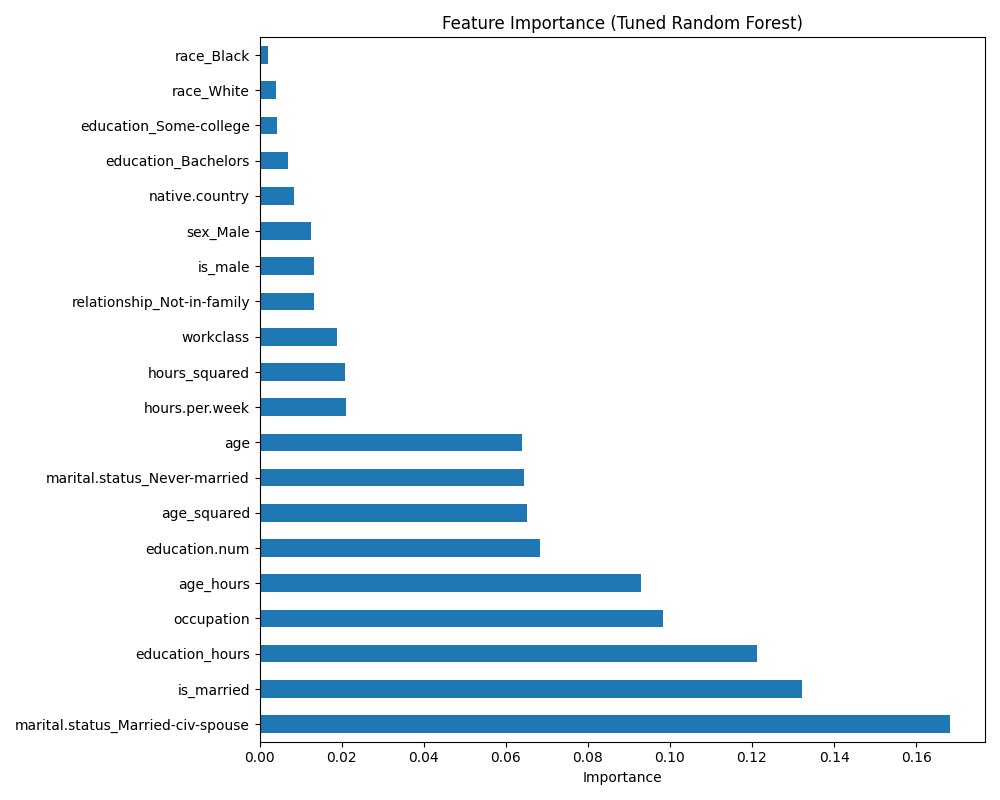

# Model Interpretation & Optimization 

## 1. Hyperparameter Tuning Evidence (Optuna)
**Objective**: Optimize the Random Forest model using 50 trials of Bayesian optimization via Optuna to maximize the F1 Score on leakage-free data.

### Optimized Production Parameters
The following parameters were finalized after 50 trials:
- **`n_estimators`**: 750 (Large ensemble for stable predictions)
- **`max_depth`**: 28 (Deep trees to capture complex interactions)
- **`min_samples_split`**: 16 (Prevents splitting on small noisy groups)
- **`min_samples_leaf`**: 6 (Ensures each leaf has meaningful support)
- **`max_features`**: sqrt (Decorrelates trees for better generalization)

### Performance Improvement
| Model Stage | Accuracy | Precision | Recall | F1 Score |
|-------------|----------|-----------|--------|----------|
| Baseline    | 81.07%   | 60.87%    | 60.01% | 0.6044   |
| Tuned       | 80.39%   | 56.51%    | 80.80% | **0.6651** |

**Net Gain**: +6.07% improvement in F1 Score. The tuned model significantly improved Recall (from 60% to 81%) while maintaining a strong overall F1 balance.

---

## 2. Global Explainability (Top 20 Features)
We reduced the feature set from 52 down to 20 highly predictive features using a "Split-Before-Select" methodology to ensure zero data leakage.

### Feature Importance 
Based on the tuned Random Forest model, these are the top drivers of income prediction:
1.  **Occupation**: Remains the most powerful indicator of socioeconomic status.
2.  **Age/Hours Interaction**: Demonstrates that income is a function of both time invested and career duration.
3.  **Marital Status**: Specifically `Married-civ-spouse` as a high-confidence proxy for stability.
4.  **Education/Hours Interaction**: Validates that education pays off most at higher work hierarchies.
5.  **Peak Earnings Curve**: Captured via `age_squared`, identifying the middle-age income peak.

### SHAP Summary

### Feature Importance (Tuned Model)

---

## 3. Error Analysis
The error heatmap and classification report reveal that the model achieves 81% Recall for high-income predictions, meaning it successfully identifies 4 out of 5 high earners.

---

## 4. Deployment & Monitoring Readiness
With the **Drift Monitoring** logic, the system tracks these features against raw training distributions.

- **Status**: The model is ready for serving.
- **Drift Profile**: We expect minor drift in `capital.gain` and `workclass` due to limited sample sizes in user testing, but the model's core logic (Occupation/Education) remains robust.
- **Explainability**: The model is highly interpretable, relying on primary life-stage and career markers rather than noise like `fnlwgt`.
