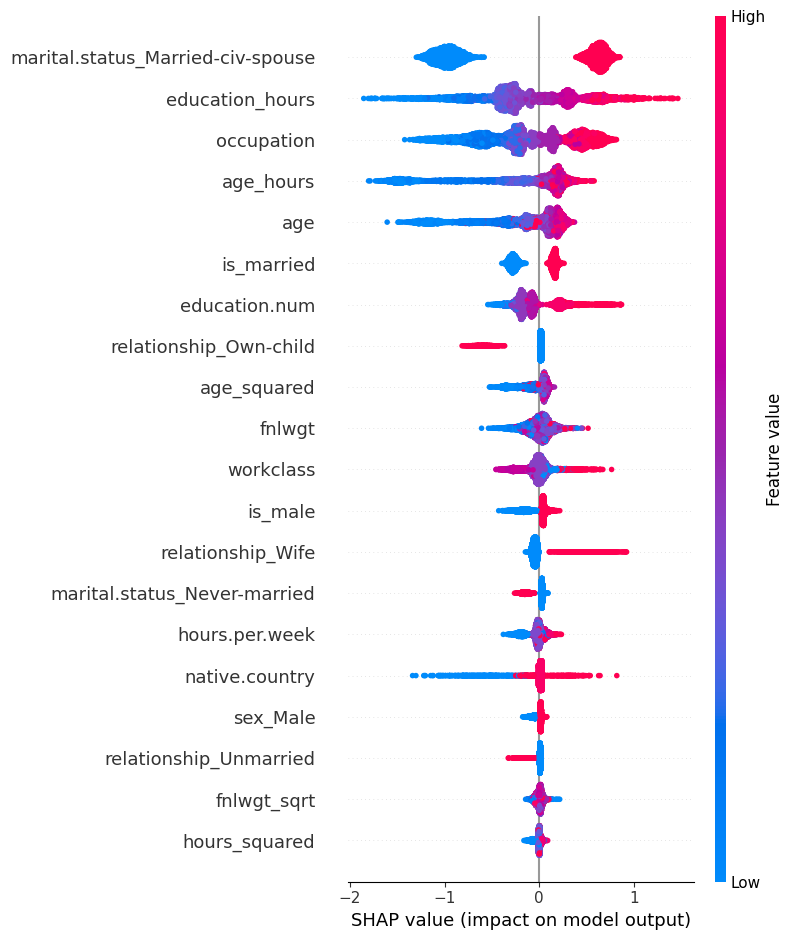
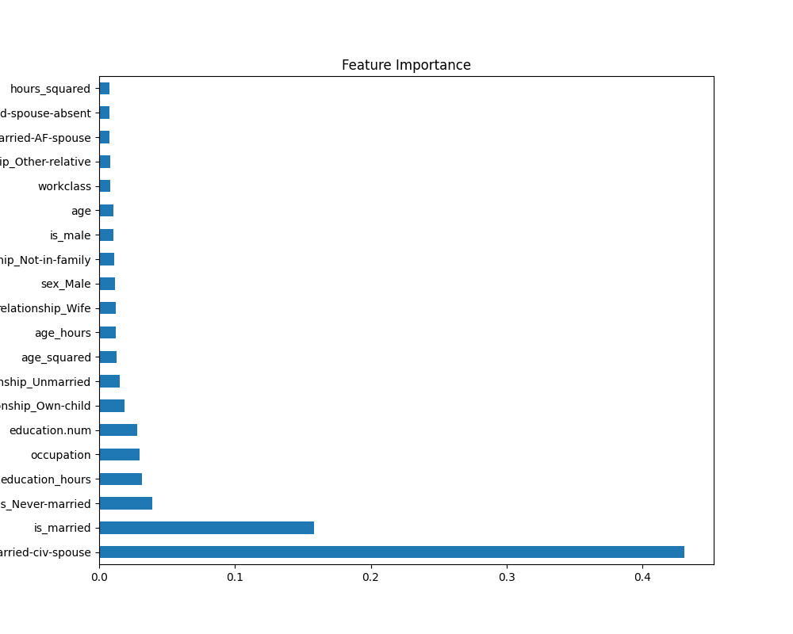
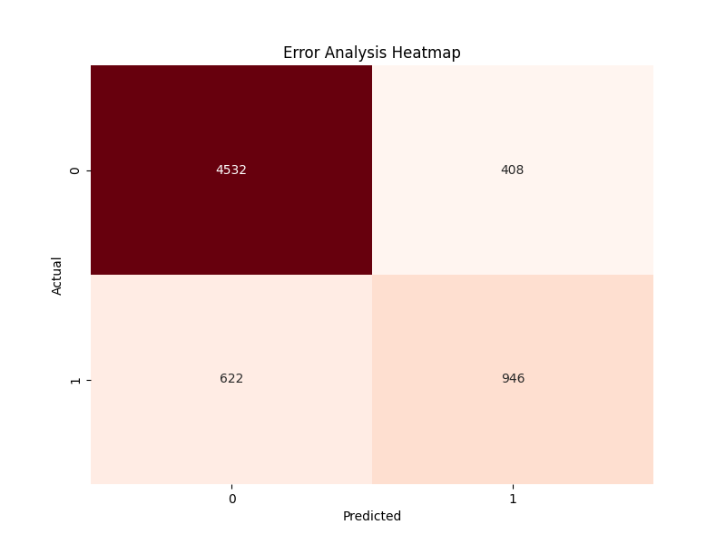

# Model Interpretation & Error Analysis

## 1. Hyperparameter Tuning Results
**Objective**: Optimize XGBoost implementation using Optuna.
**Optimization Metric**: F1 Score (due to class imbalance).

### Best Parameters Found
```json
{
    "learning_rate": 0.0187,
    "max_depth": 5,
    "n_estimators": 800,
    "subsample": 0.614,
    "colsample_bytree": 0.697,
    "gamma": 1.888,
    "min_child_weight": 1
}
```

### Performance Improvement
| Model | Metric | Score |
|-------|--------|-------|
| Baseline XGBoost (Day 3) | F1 Score | 0.626 |
| **Tuned XGBoost (Day 4)** | **F1 Score** | **0.652** |

> [!TIP]
> **Result**: The tuning process yielded a **+2.6% improvement** in F1 Score. The lower learning rate (`0.02`) combined with more estimators (`800`) suggests the model learned more granular patterns without overfitting.

---

## 2. Explainability (SHAP Analysis)
Used SHAP (SHapley Additive exPlanations) to understand how features influence the model's predictions.

### SHAP Summary

SHAP Summary Plot showing the impact of each feature on the model output.

**Key Insights**:
- **High Impact Features**: `age`, `education_num`, `hours_per_week`, and `capital_gain` are typically the strongest predictors of income > 50K.
- **Directionality**:
    - Higher `capital_gain` usually pushes the prediction towards ">50K" (positive SHAP value).
    - Lower `education_num` pushes towards "<=50K".

### Feature Importance

Global Feature Importance ranked by the model.

---

## 3. Error Analysis
Analyzed where the model makes mistakes to understand its limitations.

### Confusion Matrix Heatmap

Confusion Matrix showing True Positives, True Negatives, False Positives, and False Negatives.

### Analysis of Misclassifications
- **False Negatives (Type II Error)**: The model predicts "<=50K" but the person actually earns ">50K". This is often due to high-earning individuals in typically lower-earning demographics (e.g., young age but high capital gain).
- **False Positives (Type I Error)**: The model predicts ">50K" but the person earns "<=50K". This might happen when a person has high education or works many hours but is in a lower-paying sector.


