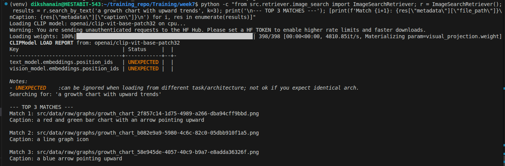

# Multimodal RAG Pipeline (Image-RAG)

This document describes the implementation of a Multimodal RAG system that handles images and scanned documents alongside text.

## Architecture Overview

The system uses a multimodal embedding space to bridge text and visual data, combined with OCR and captioning to make images "searchable" in multiple ways.

### 1. Extraction Layer
- **OCR (Tesseract)**: Extracts raw text from images and scanned PDFs. Highly useful for diagrams with labels and business forms.
- **Captioning (BLIP)**: Uses the **Salesforce/blip-image-captioning-base** model to generate natural language descriptions of visual content.

### 2. Embedding Layer
- **CLIP (Contrastive Language-Image Pre-training)**: We use **openai/clip-vit-base-patch32** to project images and text into a shared 512-dimensional vector space. 
    - This allows us to compare a *text string* to an *image* directly by calculating their cosine similarity.

### 3. Storage
- **FAISS**: The CLIP embeddings are stored in a `multimodal_index.faiss`. 
- **Metadata Store**: Along with the vectors, we store the file path, the OCR-extracted text, and the AI-generated caption.

## Features

- **Multi-Format Support**: Handles PNG, JPG, JPEG, and scanned PDFs (via conversion to images).
- **Query Modes**:
    1.  **Text → Image**: Type a description (e.g., "financial graph with green bars") to find relevant images.
    2.  **Image → Image**: Provide an image to find visually or conceptually similar images.
    3.  **Cross-Modal Answer**: Retrieves visual context to answer text-based questions about diagrams or forms.

## Implementation Screenshot
Below is the execution of the Multimodal RAG pipeline showing the ingestion and search results.

