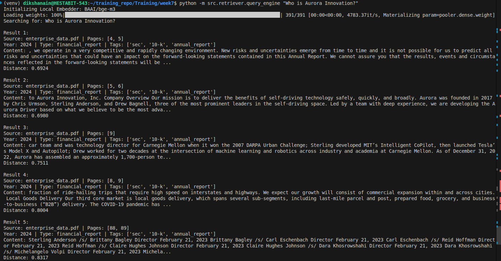
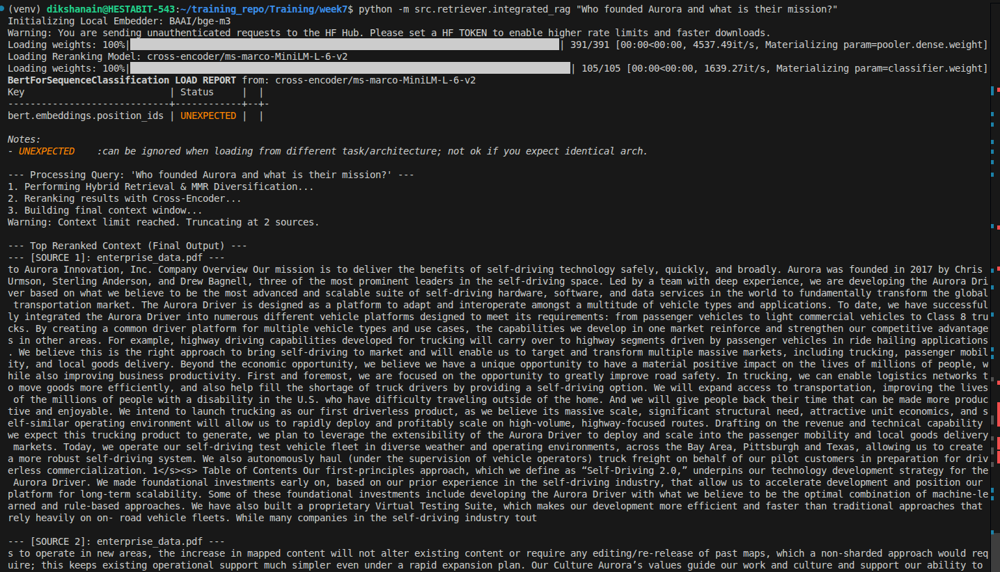
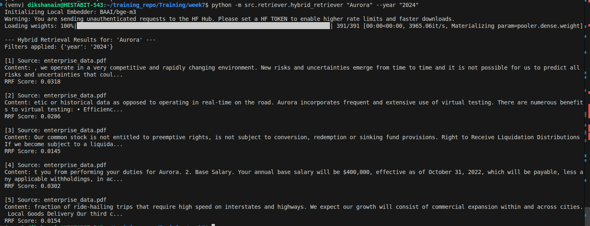

# Retrieval Strategies Documentation

This document outlines the advanced retrieval and context engineering strategies implemented to improve precision, reduce hallucinations, and ensure traceability in the RAG pipeline.

## 1. Hybrid Search (Semantic + Keyword)
We combine two different retrieval methods to cover both conceptual and exact-match queries:

- **Semantic Search (FAISS):** Uses `BAAI/bge-m3` embeddings to find conceptually related chunks. Supports an 8k context window.
- **Keyword Search (BM25):** High-precision keyword matching for specific terms.
- **Reciprocal Rank Fusion (RRF):** Combining semantic and keyword rankings using a mathematical scoring system.
  - **The Logic:** Documents ranked highly in *both* search methods get the highest final score.
  - **Formula:** $Score(d) = \sum_{r \in R} \frac{1}{60 + rank(d)}$

## 2. Metadata Tagging (Day 1 Compliance)
Every chunk in the vector store is enriched with the following mandatory tags:
- **`source`**: Original filename.
- **`page_numbers`**: Exact pages covered by the chunk.
- **`year`**: Publication year.
- **`type`**: Category (e.g., financial, legal).
- **`tags`**: Descriptive labels for targeted filtering.

## 3. Cross-Encoder Reranking
Uses a **Cross-Encoder** (`ms-marco-MiniLM-L-6-v2`) to re-score candidates.
- **Goal:** Higher precision by analyzing query and document together.

## 3. Max Marginal Relevance (MMR)
Implements diversification to reduce redundancy in the context window.
- **Strategy:** Balance relevance to query with diversity from already selected chunks.

## 4. Context Engineering
Formatting raw data for LLM consumption:
- **Deduplication:** Hash-based removal of redundant content.
- **Traceability:** Source headers (e.g., `--- [SOURCE 1]: doc.pdf ---`) for grounding.
- **Window Management:** Respecting character limits for LLM safety.

## 5. Metadata Filtering
Post-retrieval filtering for fields like `year`, `type`, and `tags`.

## 6. Verification Examples

### Example 1: Basic Metadata Check
`python -m src.retriever.query_engine "Who is Aurora Innovation?"`

### Example 2: Integrated RAG Pipeline
`python -m src.retriever.integrated_rag "Who founded Aurora and what is their mission?"`

### Example 3: Metadata Filtering
`python -m src.retriever.hybrid_retriever "Aurora" --year "2024"`

