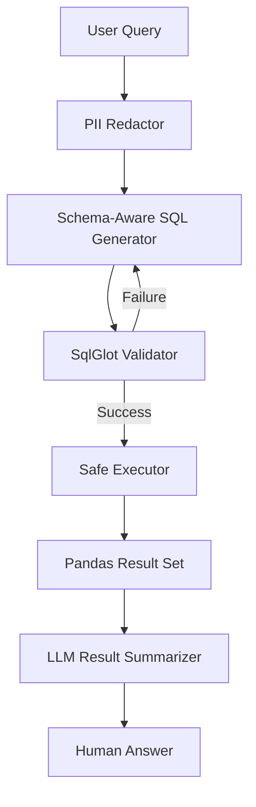
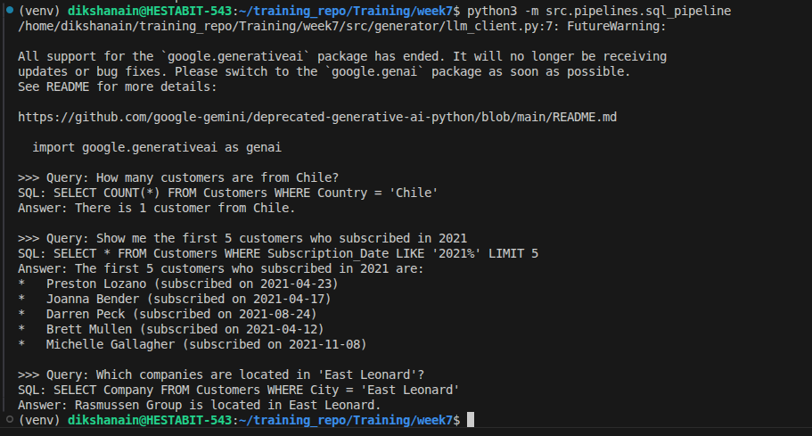

# SQL-QA DOC (Text → SQL → Answer)

## Project Overview
The SQL-QA Engine is a secure, schema-aware system that allows stakeholders to query structured enterprise data using natural language. It handles the complete lifecycle of a data request: from PII redaction and SQL translation to robust validation and natural language summarization.

## Architecture & Component Flow

1. **Policy Gate (PII Redaction)**: Scrubs emails and phone numbers from queries to ensure data privacy.
2. **Context Engineering**: Injects DDL and real **sample data** into the LLM prompt to eliminate hallucination.
3. **Safety Guard**: Uses regex and `sqlglot` to block destructive commands (`DROP`, `DELETE`) and verify schema existence before execution.
4. **Self-Correction**: If the SQL fails validation, the error is fed back to the LLM for an automatic "healing" attempt.

## Security & Reliability Features

| Feature | Implementation | Purpose |
| :--- | :--- | :--- |
| **Read-Only Lockdown** | Hardcoded keyword blocking | Ensures the system can never modify or delete data. |
| **Schema Validation** | Programmatic Object Whitelisting | Prevents "Column not found" errors at runtime. |
| **Zero-Hallucination** | Sample Data Injection | LLM "sees" actual data values to write precise filters. |
| **Summarization** | Evidence-Based Logic | The LLM must answer *only* using the provided query results. |

## Sample Query Execution

