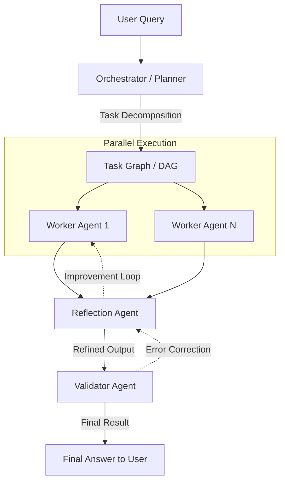

# Multi-Agent Orchestration Flow

## Description
1. **User Query**: The starting point of the interaction.
2. **Orchestrator / Planner**: Parses the query and breaks it down into a Directed Acyclic Graph (DAG) of tasks.
3. **Worker Agents**: Execute individual atomic tasks in parallel where independent.
4. **Reflection Agent**: Critiques the workers' outputs and suggests improvements.
5. **Validator Agent**: Performs a final logic and safety check before delivery.
