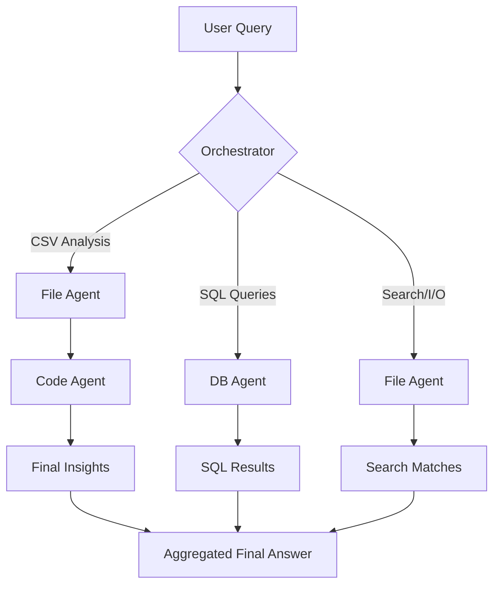

# Tool-Calling Multi-Agent System 

This document outlines the architecture and execution flow for the tool-using agent system. It covers the delegation logic from the **Orchestrator** to specialized **Tool Agents**.

## System Architecture

The core of this system is the **Tool Orchestrator**, which interprets user queries and determines which agents (Code, DB, File) are required to complete the task.



## Specialized Agents

### 1. Code Agent (`tools/code_executor.py`)
- **Capabilities**: Sandbox execution of Python code, captures `stdout` and `stderr`.
- **Usage**: Statistical analysis, data transformation, and dynamic computation.

### 2. DB Agent (`tools/db_agent.py`)
- **Capabilities**: Connects to SQLite, performs schema inspection, and executes SQL.
- **Usage**: Querying structured datasets and extracting database snapshots.

### 3. File Agent (`tools/file_agent.py`)
- **Capabilities**: Read/Write `.txt` and `.csv`, and local string-based search engine.
- **Usage**: Data ingestion for analysis and persistent storage.

## Orchestration Example: "Analyze `sales.csv`"

When the user requests an analysis of a CSV file, the following **Tool Chain** is executed:

1.  **Step 1 (File Agent)**: The orchestrator extracts `sales.csv` and invokes `FileAgent.read_csv()`.
2.  **Step 2 (Code Agent)**: The raw data is formatted into a Python list/dict and passed to `PythonCodeExecutor` with an analysis script (e.g., "Find top 5 trends").
3.  **Step 3 (Analysis)**: The code executor returns the result of the script to the orchestrator.
4.  **Step 4 (Final Answer)**: The orchestrator combines the raw results into a human-readable format.

## Execution Instructions

Each component is designed to be modular. You can test them individually or via the main orchestrator:

```bash
# To run the orchestrator (manual test):
python3 tool_orchestrator.py
```


